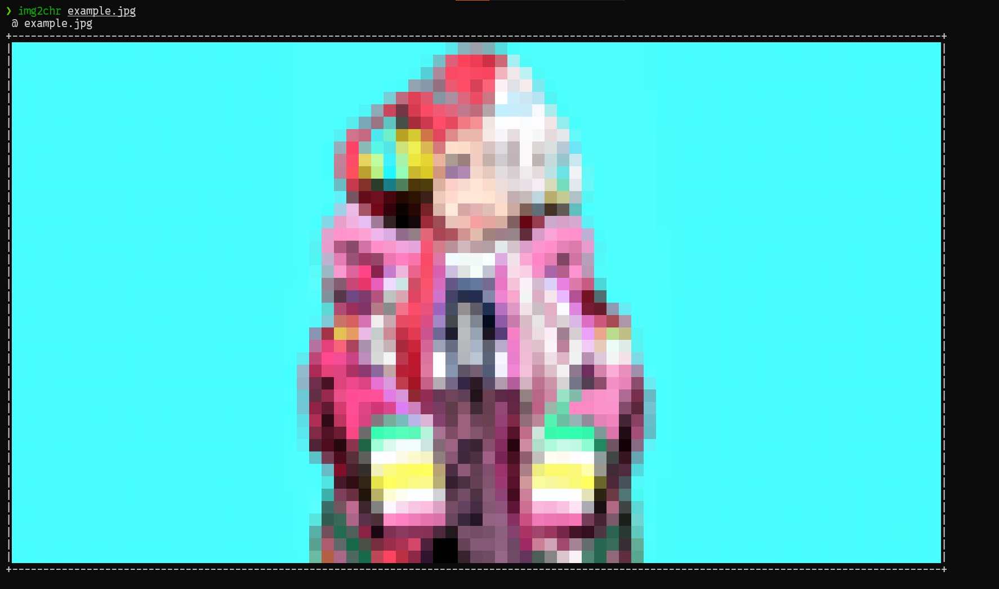
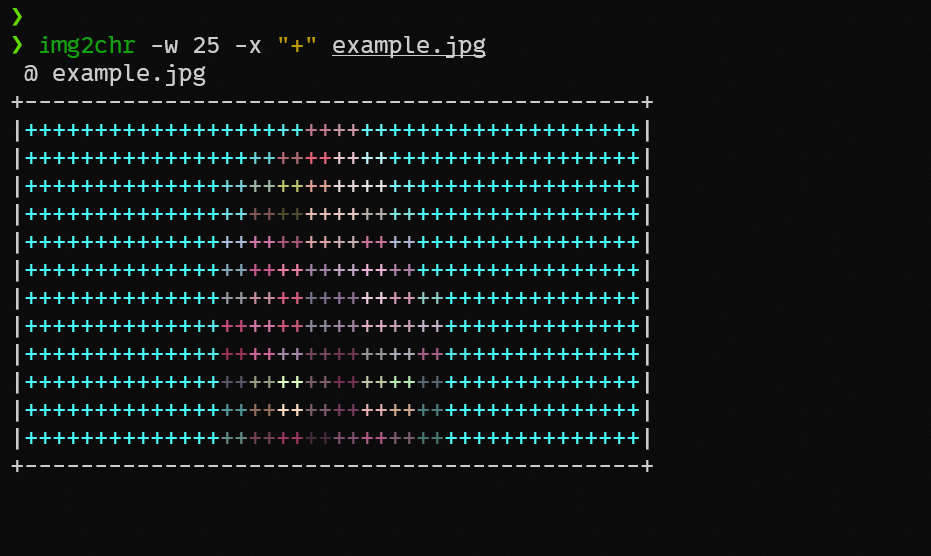

# img2chr


## Introduction

A program that prints images as characters.

> [!Note]
> This project only contain a single file.

## Screenshot

> [!Note]
> reference only, version for 1.1.1





## Dependencies

- **Python3-package**  `pillow`

```sh
$ sudo pip install pillow
```

- **Linux tool**  `tput`  [optional]

> [!Note]
> `img2chr` uses `tput` to control the print width.

> [!Tip]
> You can also manually control the print width using the `-x` option.

```sh
$ pkg install ncurses-utils # on termux
```

## Install

### download the script file
- Clone this repository to your local.

```sh
$ git clone https://github.com/Lavenir7/img2chr
```

- Or just download the script file.

```sh
$ curl -fL https://github.com/Lavenir7/img2chr/raw/refs/heads/main/script/img2chr
```

### add to path

make sure `/usr/local/bin/` is in your path
```sh
$ sudo mv img2chr /usr/local/bin/img2chr
```

or move script file directly on the `/usr/bin/` (:caution: exercise caution!)
```sh
$ ls /usr/bin/ | grep "img2chr" # check to avoid overwriting other file
$ sudo mv img2chr /usr/bin/img2chr
```

## Usage

- **normal**

print the image:
```sh
$ img2chr example.jpg
```

- **with parameters**

print the image with `+` at the widest width of `25`
```sh
$ img2chr -w 25 -x "+" example.jpg
```
> [!Tip]
> you can view descriptions of other parameters by `img2chr -h`

## End

Welcome to submit bugs in issues!

